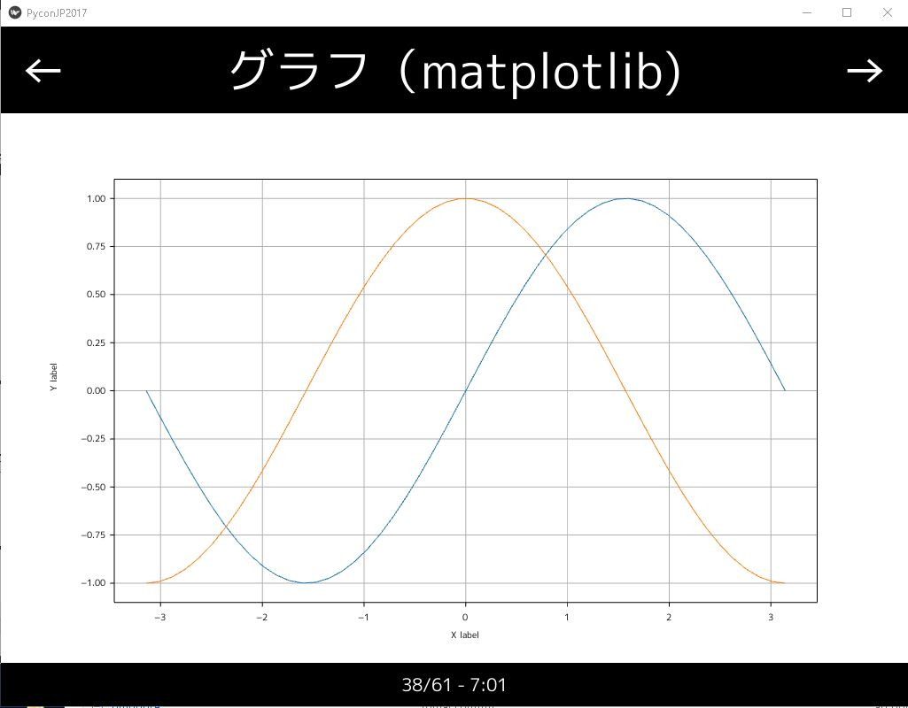
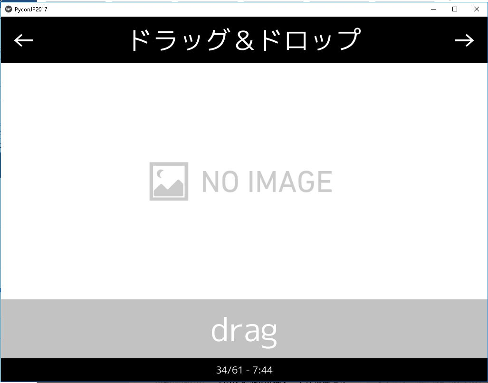

# kivy_pyconjp2017について

2017年９月８日、９日に行われるPyconJPのトーク[Kivyによるアプリケーション開発のすすめ](https://pycon.jp/2017/ja/schedule/presentation/20/)のサンプルコード件スライドです。

実行サンプル1


実行サンプル2



# 動作環境
動作環境は以下の通りです
+ Windows10
+ Kivy1.10

## 依存ライブラリーについて

+ numpy
+ matplotlib
+ kivy garden.matplotlib
+ kivy garden.mapview

※garden.graphはローカル（graphフォルダ配下）で修正しています。
コメントアウトしていますがcamera機能を使用するにはOpencvのインストールが必要です

kivy garden.matplotlibのインストールは以下の通りです。

```
pip install kivy-garden
garden install matplotlib
garden install mapview
```

# そのほか
本番のトークではフォントが有料フォントを使ってデモをする予定です。
フォントが変わった関係で一部文字が長いスライドは上の数行の文字が見えません。
後日終了予定です

コードを整理、分割、コメントの追加を行う予定

# 参考にしたコード

スライドは以下のコードをベースに改良を加えました。
+ [https://github.com/tshirtman/pycon-fr-2014-kivy](https://github.com/tshirtman/pycon-fr-2014-kivy)

また以下のコードも参考にしました
+ [https://github.com/diegodukao/slides-pyrj]https://github.com/diegodukao/slides-pyrj()


※以降、追加予定